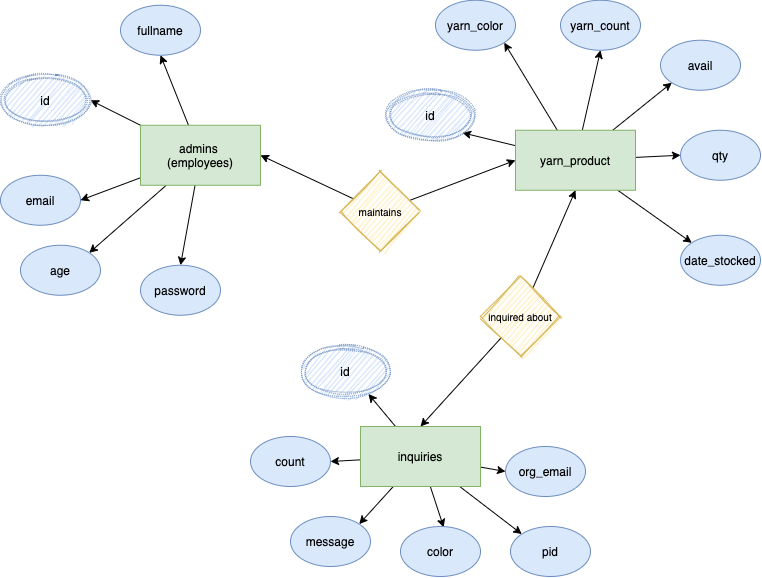
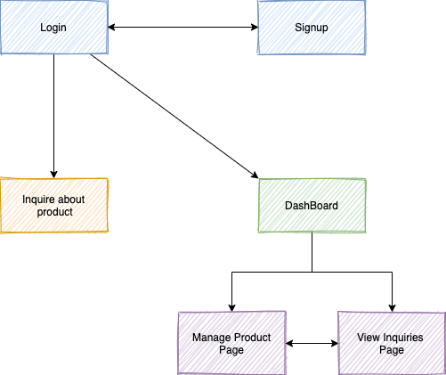
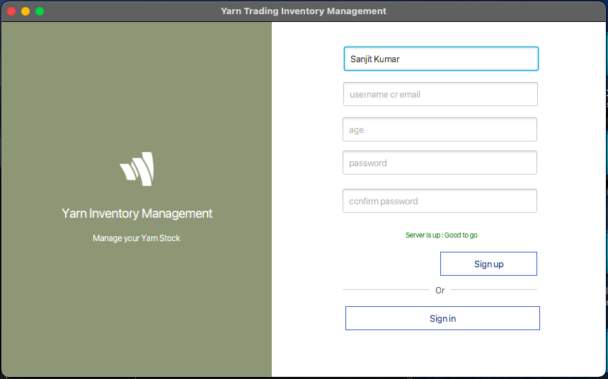
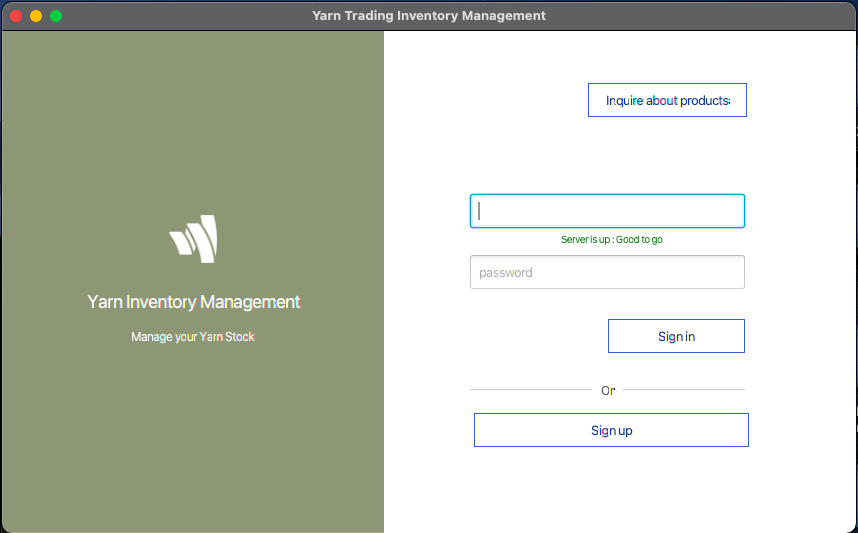
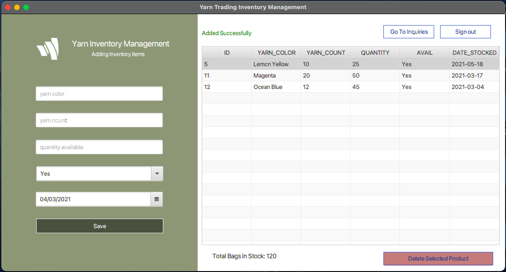
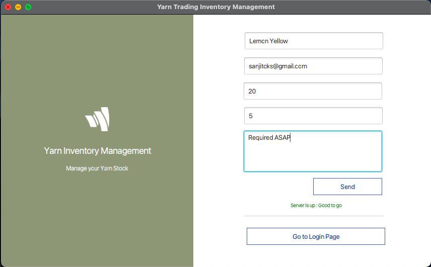
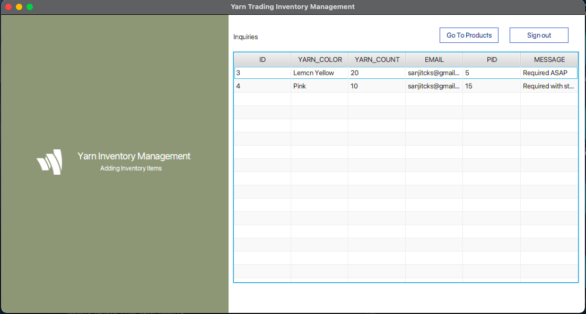

# Yarn Product Inventory Manager

*CSE1007 Java Programming - Digital Assignment - Winter 2021*

A simple JavaFX product inventory tool to keep track of products and inquiries generated for them. Uses a local MySQL database to store the login and product/inquiry information.

## How to run?

- Clone the Repo
- Install the JavaFX SDK from [here](https://gluonhq.com/products/javafx/)
- Add VM Path
- Also install the JDBC MySQL Connector from [here](https://dev.mysql.com/downloads/connector/j/)
- Unzip and save the extracted directory in your local drive (lib dir inside this)
- In Intellij Idea: open the repo, go to project preferences and add the lib directory as a library
- Also add the mysql jdbc connector jar file
- Build and Run the Main.java file

## ER Diagram

## Flow

## Pages

SignUp

SignIn

Manage Products

Send Inquiry

View Inquiries for Employee

